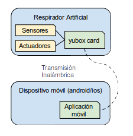
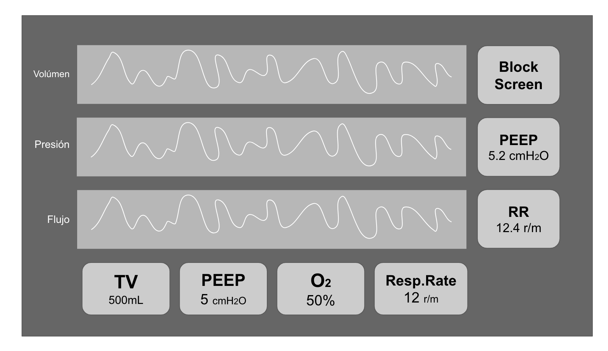

APLICACIÓN MOVIL
================

DESCRIPCIÓN GENERAL
-------------------

La aplicación móvil OpenVenti tiene como finalidad el monitoreo y administración del respirador artificial del mismo nombre, de forma segura e intuitiva.

PERSPECTIVA
^^^^^^^^^^^

**Estructura de la Aplicación**

  

USUARIOS
^^^^^^^^

FUNCIONES
^^^^^^^^^
aaaa

EMPAREJAMIENTO
~~~~~~~~~~~~~~

VISUALIZACIÓN DE DATOS
~~~~~~~~~~~~~~~~~~~~~~

RECEPCIÓN DE DATOS
~~~~~~~~~~~~~~~~~~

CIERRE DE CESIÓN
~~~~~~~~~~~~~~~~

PANTALLA 
--------

TRAMAS DE COMUNICACIÓN
----------------------

DATOS DE GRÁFICAS
^^^^^^^^^^^^^^^^^

**Orientación**

Yubox ---> Cliente

.. csv-table::  **Parámetros de Entrada**
   :header: "Atributo", "Detalle"
   :widths: 40, 500

     "t","Tipo de trama siendo 0 una trama de datos de gráficas"
     "d", "Arreglo de datos para las tres gráficas, representando un punto a la vez"
..

**JSON IN**

.. code-block:: javascript

 { 
   "t":0,
   "d":[
     (double), 
     (double),
     (double)
   ]
 }
..

**JSON EJEMPLO**

.. code-block:: javascript

  { 
    "t":0,
   "d":[
     1.2, 
     2.01,
     3
   ]
 }
..

SETEO DE PARÁMETROS
^^^^^^^^^^^^^^^^^^^

**Orientación**

Cliente -> Yubox -> Cliente

.. csv-table::  **Parámetros de Entrada**
   :header: "Atributo", "Detalle"
   :widths: 40, 500

     "**id**", "Identificador de transacción. Permite mapear respuestas a peticiones."
     "**action**","Acción a realizar. Para el seteo de parámetros es la cadena **set** "
     "**param**", "Parámetro del respirador que se quiere setear (Valores posibles: **TV,**  **PEEP,** **O2,** **RR**)."
     "**value**", "Valor que se desea setear al parámetro definido en **param**" 
     "**ts**", "Timestamp en formato UNIX en el que se realiza la petición."
     "**token**", "Token HMAC para autenticación e integridad de datos."
..

.. note::

  **ts:** En formato Unix necesario para evitar ataques de replay.
  **token:** Deberá calcularse sobre la trama con el token seteado en una cadena vacía.
..

**JSON IN**

.. code-block:: javascript

 {
    "id": (int),
    "action": "set",
    "param": (string),
    "value": (mixed),
    "ts": (int),
    "token": (string)
 }
..

**JSON EJEMPLO**

.. code-block:: javascript

 { 
    "id":12345,
    "action":"set",
    "param":"PEEP",
    "value":5.2,
    "token":"ba837ba9ba837ba9ba837ba9ba837ba9ba837ba9"
 }
..

**JSON RESPUESTA**

.. code-block:: javascript

 {
    "id":12345,
    "status":200,
    "msg":"Operación_Exitosa",
    "value":5.2,
    "token":"1231231212312312123123121231231212312312"
 }
..

.. csv-table::  **Respuesta**
   :header: "Atributo", "Detalle"
   :widths: 40, 500

     "**id**", "dentificador de transacción. Permite mapear respuestas a peticiones."
     "**status**","Estado de cumplimiento de la transacción."
     "**msg**", "Respuesta del resultado de la transacción."
     "**value**", "Valor que se desea setear al parámetro definido en **param**." 
     "**token**", "Token HMAC para autenticación e integridad de datos."
..

.. note::
  La respuesta deberá reflejar el mismo id recibido en la petición.
..

OBTENCIÓN DE PÁRAMETROS
^^^^^^^^^^^^^^^^^^^^^^^

Cliente -> Yubox -> Cliente

.. csv-table::  **Parámetros de Entrada**
   :header: "Atributo", "Detalle"
   :widths: 40, 500

     "**id**", "Identificador de transacción. Permite mapear respuestas a peticiones."
     "**action**","Acción a realizar. Para el seteo de parámetros es la cadena **get**."
     "**param**", "Parámetro del respirador que se quiere setear (Valores posibles: **TV,**  **PEEP,** **O2,** **RR**)."
     "**token**", "Token HMAC para autenticación e integridad de datos."
..

.. note::
  **token:** Deberá calcularse sobre la trama con el token seteado en una cadena vacía.
..

**JSON IN**

.. code-block:: javascript

 {
    "id": (int),
    "action": "get",
    "param": (string),
    "token": (string)
 }
..

**JSON EJEMPLO**

.. code-block:: javascript

 {
    "id":12345,
    "action":"get",
    "param":"PEEP",
    "token":"ba837ba9ba837ba9ba837ba9ba837ba9ba837ba9"
 }
..

**JSON RESPUESTA**

.. code-block:: javascript

 {
    "id":12345,
    "status":200,
    "msg":"Operación_Exitosa",
    "value":5.2,
    "token":"1231231212312312123123121231231212312312"
 }
..

.. csv-table::  **Respuesta**
   :header: "Atributo", "Detalle"
   :widths: 40, 500

     "**id**", "Identificador de transacción. Permite mapear respuestas a peticiones."
     "**status**","Estado de cumplimiento de la transacción."
     "**msg**", "Respuesta del resultado de la transacción."
     "**value**", "Valor que se desea setear al parámetro definido en **param**." 
     "**token**", "Token HMAC para autenticación e integridad de datos."
..

.. note::
  La respuesta deberá reflejar el mismo id recibido en la petición.
..

ENVÍO DE ALERTAS
^^^^^^^^^^^^^^^^

**Orientación**

Yubox -> Cliente

.. csv-table::  **Parámetros de Entrada**
   :header: "Atributo", "Detalle"
   :widths: 40, 500

   "**t**", "Tipo de trama siendo 1 una trama de alerta."
   "**msg**", "Cadena que describe la alerta."
   "**severidad**", "Nivel de riesgo de la alerta." 
..

**JSON IN**

.. code-block:: javascript

 {
   "t":1,
   "msg": (string),
   "severidad": (int)
 }
..

**JSON EJEMPLO**

.. code-block:: javascript

 {
    "t":1,
    "msg":"Oxígeno agotado",
    "severidad":5
 }
..