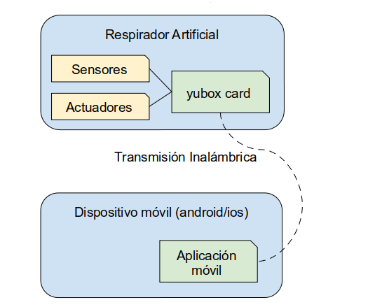

APLICACIÓN MOVIL
================

DESCRIPCIÓN GENERAL
-------------------

La aplicación móvil OpenVenti tiene como finalidad el monitoreo y administración del respirador artificial del mismo nombre, de forma segura e intuitiva.

El sistema estará constituido por los siguientes componentes:

-CAD
-CAMo
-Seguridades y Administración

**Estructura de la Aplicación**

FLUJO DE TRABAJO
-----------------

FUNCIONES
^^^^^^^^^

USUARIOS
~~~~~~~~

EMPAREJAMIENTO
~~~~~~~~~~~~~~

.. image:: img/con.png
  :width: 300

VISUALIZACIÓN DE DATOS
~~~~~~~~~~~~~~~~~~~~~~

TRANSIMISIÓN DE DATOS
~~~~~~~~~~~~~~~~~~~~~

Se usara tecnología Wifi, aplicando norma ANSI/TIA 1149, motivo controlar que el espectro radioeléctrico y no obstaculizar conexión de otros equipos, incluso otros ventiladores.

La norma ANSI/TIA 1149 se usa para Servicio de Alerta Móvil Comercial (CMAS) sobre los sistemas CDMA 

RECEPCIÓN DE DATOS
~~~~~~~~~~~~~~~~~~

PANEL DE ADMINISTRACIÓN
~~~~~~~~~~~~~~~~~~~~~~~

CIERRE DE CESIÓN
~~~~~~~~~~~~~~~~

TRATAMIENTO DEL PACIENTE
------------------------

HISTORIA CLÍNICA
^^^^^^^^^^^^^^^^

Número que identifica de manera única al paciente, incluso si regresa a la Institución. 
Puede ser utilizado el número de DNI. A obtener del HIS del lugar de atención, de ex

PANTALLA 
--------

.. image:: img/screen.png
  :width: 400

Los Botones de abajo permiten modificar los siguientes parámetros:

    1) TV o Tidal Volume, que puede estar entre 450 y 600 mL
    2) PEEP o Presión positiva remanente, que puede estar entre 0 y 8 cmH2o
    3) Porcentaje de Oxígeno, que puede estar entre 0 y 50%
    4) RR o Respiration Rate o Respiraciones por minuto, que puede estar entre 9 y 16

