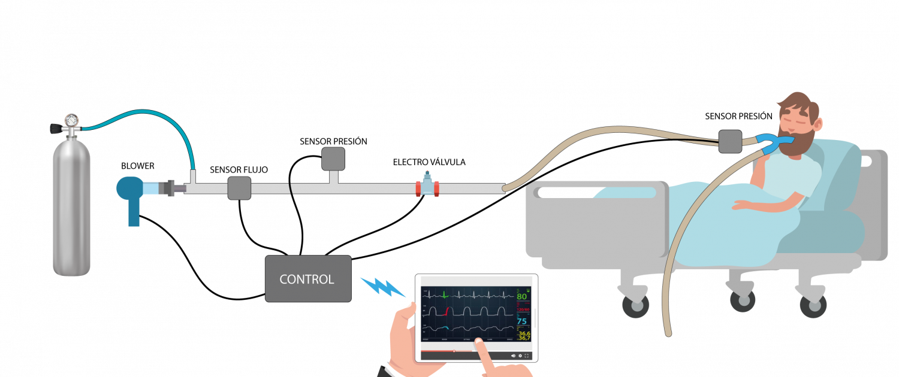

OPENVENTI
=========

El objetivo de OpenVenti es diseñar un Respirador Artificial que cualquiera pueda construir en cualquier país, para mitigar el problema que hoy en día existe en los hospitales del mundo, 
y dar una oportunidad a miles de pacientes que son devueltos a casa sin esperanza de sobrevivir.”

**Sitio Web**

**Descripción del Proyecto**

.. toctree::
   
   files/app
   files/hardware
   files/firmware
   files/webserver
   

